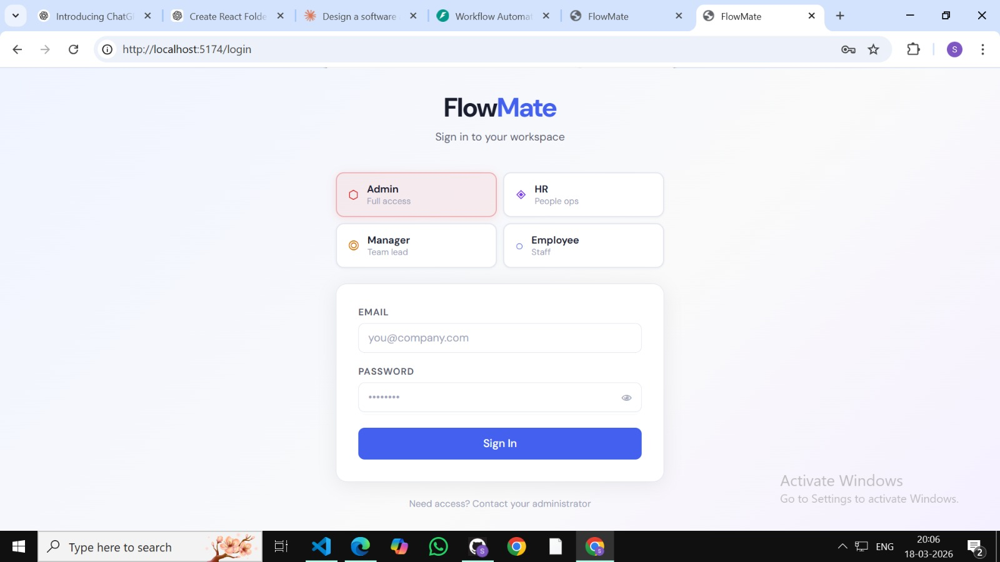
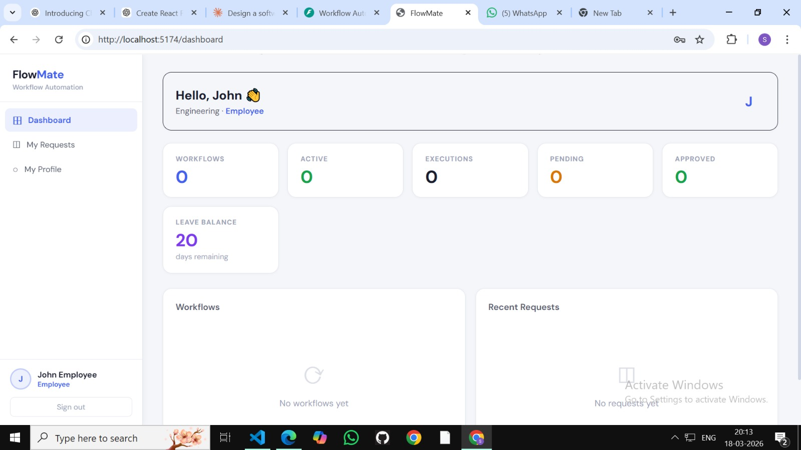
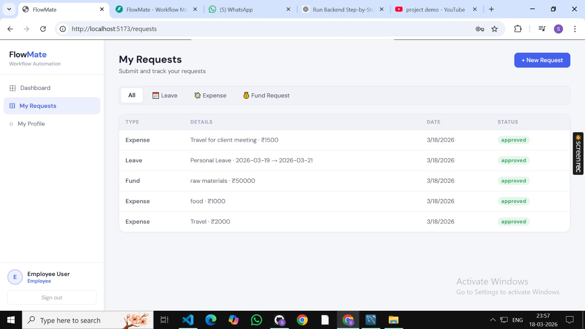
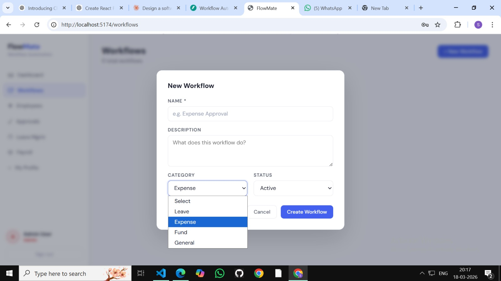
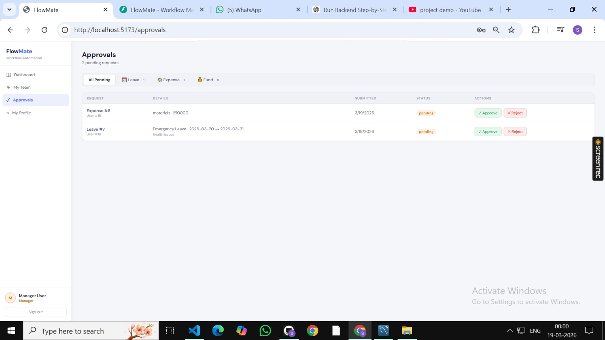

# FlowMate - Workflow Automation System

## Demo Video

Watch demo video of FlowMate workflow automation system showing login and dashboard features
Link
(https://img.youtube.com/vi/l8TCH61kEns/0.jpg)]
(https://youtu.be/l8TCH61kEns)

-------------------------------------------------------------------------------------------------------------------

## Screenshots

## Login Page
!

## Dashboard 


## Request Page


## Workflow


## Approval Page

--------------------------------------------------------------------------------------------------------------------

## Tech Stack

* **Frontend:** React + Vite
* **Backend:** FastAPI
* **Database:** MySQL

--------------------------------------------------------------------------------------------------------------------

## Run Project

### Backend Setup

```bash
cd backend
python -m venv venv
venv\Scripts\activate     # Windows
pip install -r requirements.txt
uvicorn app.main:app --reload
```

Application runs on: http://127.0.0.1:8000
API documentation: http://127.0.0.1:8000/docs

--------------------------------------------------------------------------------------------------------------------

### Frontend Setup

```bash
cd frontend
npm install
npm run dev
```

Application runs on: http://localhost:5174

--------------------------------------------------------------------------------------------------------------------

## Features

* Role-based authentication (Admin, HR, Manager, Employee)
* Leave, expense, and fund request management
* Workflow automation system
* Approval flow for managers
* Dashboard with key metrics

--------------------------------------------------------------------------------------------------------------------

## Notes

* Ensure PostgreSQL is running before starting the backend
* Update the `.env` file with correct database credentials
